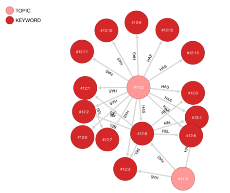

# Project vör : Open Knowledge modeling

---



---

## Synopsis

The project is initiated as a dirty hack for crawling and modeling 
a large volume of open knowledge out there in Wikipedia. Thus, we 
have a "nearly" complete graph of those knowledge, also obtain an 
ability to traverse the relations between knowledge topics.

---

## Infrastructure

To build and run the knowledge graph engine with vör, 
you need the following software for the infrastructure.

- [x] OrientDB
- [x] MongoDB

---

## Setup

Install python 3.x requirements by:

```bash
  $ pip3 install -r -U requirements.txt
```

In an opposite direction, collect the requirements with:

```bash
  $ pipreqs .
```

---

## Download (crawl) wikipedia pages

Execute:

```bash
  $ python3 crawl_wiki.py --verbose 
```

The script continuously and endlessly crawls the knowledge topic 
from Wikipedia starting from `Jupiter` page. You may change 
the initial topic within the script to what best suits you. 
To stop the process, just terminate is fine. It won't leave 
anything at dirty state.

>**[NOTE]** The script keeps continuously crawling 
and downloading the related knowledge through link traveral. 
**The script never ends unless you terminate it.**

---

## Build the knowledge graph

Execute:

```bash
  $ python3 build_knowledge.py --verbose --root {PASSWORD}
```

Where `{PASSWORD}` represents your `root` password of **OrientDB**.

What the script does is simply imports the entire raw hefty text 
knowledge from **MongoDB** to **OrientDB** as a big graph. 
The output graph in OrientDB is built from the following components:

- [1] **Vertices** : Represent topic / keyword
- [2] **Edges** : Represent relations between topic-keyword or keyword-keyword.

> **[NOTE]** The script processes the entire data in the collection 
all the way to the end. This will definitely take large amount of 
time if you have large data in your collection.

--- 

## Licence

The project is licenced under [GNU 3 public licence](https://www.gnu.org/licenses/gpl-3.0.en.html).

---
