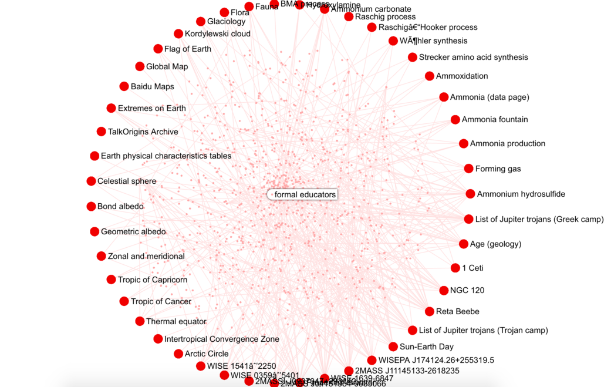
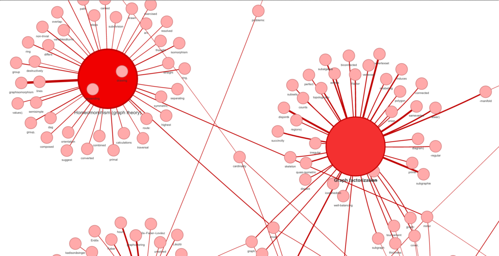
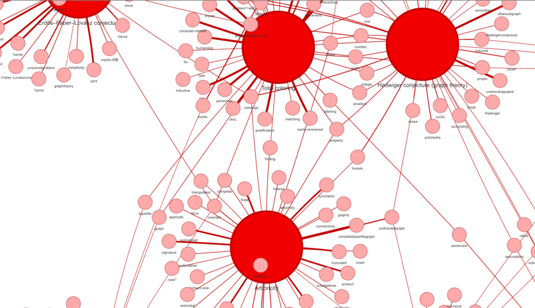

# Project vör : Open Knowledge modeling

---




---

## Synopsis

The project is initiated as a dirty hack for crawling and modeling 
a large volume of open knowledge out there in Wikipedia. Thus, we 
have a "nearly" complete graph of those knowledge, also obtain an 
ability to traverse the relations between knowledge topics.

---

## Infrastructure / Prerequisites

To build and run the knowledge graph engine with vör, 
you need the following software for the infrastructure.

- [x] [OrientDB](http://orientdb.com/download/)
- [x] [MongoDB](https://www.mongodb.com/download-center#community)

---

## Setup

Install python 3.x requirements by:

```bash
  $ pip3 install -r -U requirements.txt
```

Install Node.js modules required by the graph visualiser. 
You may ignore these steps if you are not interested in 
visualisation.

```bash
  $ npm install
```

Other than registered NPM packages, you also need to [install Sigma.js 
for visualisation](https://github.com/jacomyal/sigma.js/wiki#getting-started). The module is not bundled within this repository.

---

## 1) Download (crawl) wikipedia pages

Execute:

```bash
  $ python3 crawl_wiki.py --verbose 
```

The script continuously and endlessly crawls the knowledge topic 
from Wikipedia starting from the seeding page. You may change 
the initial topic within the script to what best suits you. 
To stop the process, just terminate is fine. It won't leave 
anything at dirty stat so you can re-execute the script again 
at any time.

>**[NOTE]** The script keeps continuously crawling 
and downloading the related knowledge through link traveral. 
**The script never ends unless you terminate it.**

---

## 2) Build the knowledge graph

Execute:

```bash
  $ python3 build_knowledge.py --verbose --root {PASSWORD} --limit {NUM}
```

Where `{PASSWORD}` represents your `root` password of **OrientDB**.
And `{NUM}` represents the number of wikipedia topics to process.

What the script does is simply imports the entire raw hefty text 
knowledge from **MongoDB** to **OrientDB** as a big graph. 
The output graph in OrientDB is built from the following components:

- [1] **Vertices** : Represent topic / keyword
- [2] **Edges** : Represent relations between topic-keyword or keyword-keyword.

> **[NOTE]** The script processes the entire data in the collection 
all the way to the end. This will definitely take large amount of 
time if you have large data in your collection.

---

## 3) Visualise the knowledge graph

Execute:

```bash
  $ node visualise {PASSWORD}
```

Where `{PASSWORD}` is your OrientDB root's password. The script 
downloads the graph data from OrientDB, renders it with appropriate 
visual figure. After it's done, you can view the graphs as follows.

- [1] Universe of topics graph [`html/graph-universe.html`].
- [2] Index graph [`html/graph-index.html`.]


---

## 4) Build Word2Vec model over the crawled data

Execute:

```bash
  $ python3 build_wordvec.py --limit {LIMIT} --out {PATH_TO_MODEL}
``` 

There should be sufficient amount of the downloaded wikipedia 
in MongoDB which is done by running `crawl_wiki.py`. The output 
is a binary file.

---

## 5) Create topic index

Execute:

```bash
  $ python3 build_index.py --limit {LIMIT} --root {PASSWORD}
```

The script generates another OrientDB collection `vorindex` 
which contains all invert-index of the topics and their 
corresponding keywords. Weights of the edges are calculated 
by how frequent the word appear in each of the topics.




---

## Licence

The project is licenced under [GNU 3 public licence](https://www.gnu.org/licenses/gpl-3.0.en.html). All third party libraries are redistributed 
under their own licences.

---
